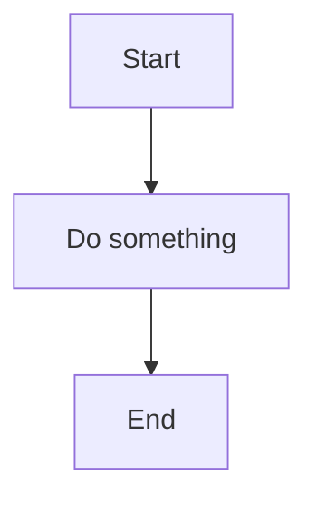

# astro-blog

A personal blog built with [Astro](https://astro.build), MDX, and Mermaid diagram support.

## Prerequisites

- [Node.js](https://nodejs.org/) v18.17+ (v24 recommended)

## Getting started

```sh
npm install
npm run dev
```

The dev server starts at `http://localhost:4321` (may use the next available port if 4321 is taken).

## Commands

| Command           | Action                                      |
| :---------------- | :------------------------------------------ |
| `npm run dev`     | Start local dev server                      |
| `npm run build`   | Build production site to `./dist/`          |
| `npm run preview` | Preview production build locally            |

## Project structure

```text
src/
  content/
    blog/          ← blog posts (.md or .mdx)
  layouts/
    BlogPost.astro ← layout for all blog posts
  components/      ← reusable UI components
  pages/
    index.astro    ← homepage
    blog/          ← blog index and post routes
  assets/          ← images and fonts
public/            ← static files served as-is
astro.config.mjs   ← Astro config (MDX integration)
```

## Writing articles

### Plain Markdown post

Create a `.md` file in `src/content/blog/`:

```md
---
title: 'My Post Title'
description: 'A short description'
pubDate: '2024-06-01'
heroImage: '../../assets/blog-placeholder-1.jpg'
---

Your content here.
```

### MDX post (with components or diagrams)

Create a `.mdx` file in `src/content/blog/`. MDX supports everything Markdown does, plus JSX components and Mermaid diagrams.

### Adding Mermaid diagrams

In any `.mdx` post, use a fenced code block with `mermaid` as the language:

````md

````

Mermaid diagrams are rendered client-side automatically. Supported diagram types include flowcharts, sequence diagrams, ER diagrams, Gantt charts, and more — see the [Mermaid docs](https://mermaid.js.org/intro/).

### Frontmatter fields

| Field         | Required | Description                        |
| :------------ | :------- | :--------------------------------- |
| `title`       | Yes      | Post title                         |
| `description` | Yes      | Short description (used in SEO)    |
| `pubDate`     | Yes      | Publication date (`YYYY-MM-DD`)    |
| `updatedDate` | No       | Last updated date                  |
| `heroImage`   | No       | Path to hero image                 |

## Tech stack

- [Astro](https://astro.build) — static site framework
- [@astrojs/mdx](https://docs.astro.build/en/guides/integrations-guide/mdx/) — MDX support
- [Mermaid](https://mermaid.js.org) — diagram rendering (client-side via CDN)
- [@astrojs/sitemap](https://docs.astro.build/en/guides/integrations-guide/sitemap/) — sitemap generation
